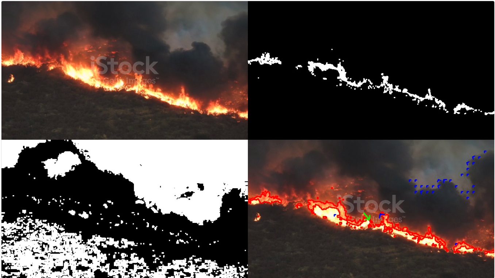
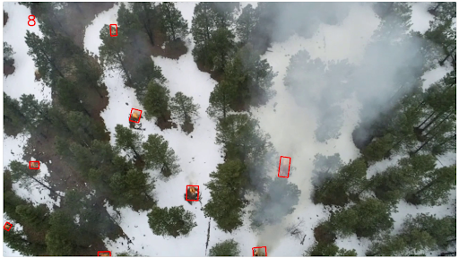
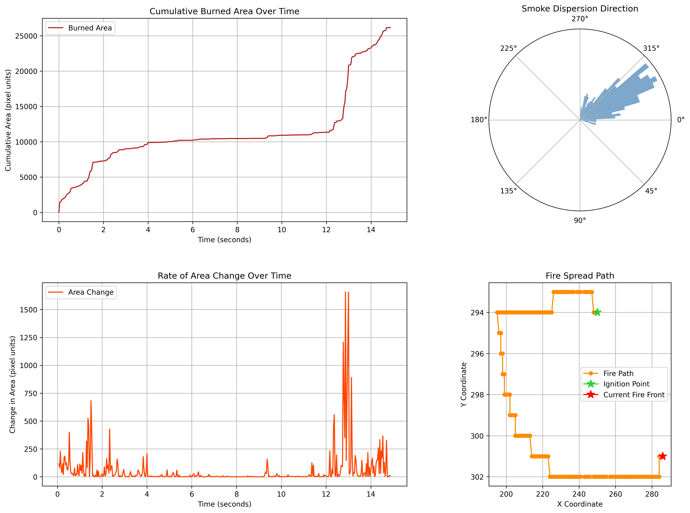

# *The University of Alaska: Wildfire Research*
- *2021 Forest Fires:*  
  2021 was one of the worst years for forest fires, with an alarming *9.3 million hectares* of tree cover loss globally, accounting for over one-third of all tree cover loss that occurred that year.  
  Source: [WRI Global Forest Trends](https://www.wri.org/insights/global-trends-forest-fires)

- *Rising Trend in Forest Loss (2001-2019):*  
  There has been a significant global increase in forest loss due to fires, driven by near-uniform increases across the tropics, subtropical, temperate Australia, and boreal Eurasia.  
  Source: [Frontiers in Remote Sensing](https://www.frontiersin.org/articles/10.3389/frsen.2022.825190/full)

---

### Steps to Run Locally
1. Clone the repository.
2. Create and activate a virtual environment:
```
- On Windows:
  python -m venv venv
  .\venv\Scripts\activate
  
- On macOS and Linux:
  python3 -m venv venv
  source venv/bin/activate
```

3. Install required packages: ```pip install -r requirements.txt``` 
4. Change directory to the code_web folder.
5. Run the application: ```python app.py``` 
6. Open a web browser and click on the URL in the console output.

Download wildfire videos [Google Drive](https://drive.google.com/drive/folders/13rKzSe9je3NbLef-sT9k_1ldjVA7FJbW?usp=sharing).

## *Dataset*
Download the dataset [Roboflow]().

## *Results*

### 1. Fire and Smoke Motion in forestFire1 video


### 2. Fire Detection on IEEE video


### 3. Wildfire Analysis on test5 video


## *Documentation*
For detailed function explanations, please refer to our [Google Doc](https://docs.google.com/document/d/1ibWxNxHIlFAsgaGLRBZVBcKMjpvNC0qOaEbWtlkSTVI/edit?usp=sharing).

## *Contributing*
We welcome contributions to this research work.
For any queries or further information, please contact:
- Dr. Arghya Kusum Das: akdas@alaska.edu
- Yali Wang: ywang35@alaska.edu
- Debjit Konar: djksg34@gmail.com
- Vikas Rajpurohit: vikasrazz158@gmail.com

Thank you!
